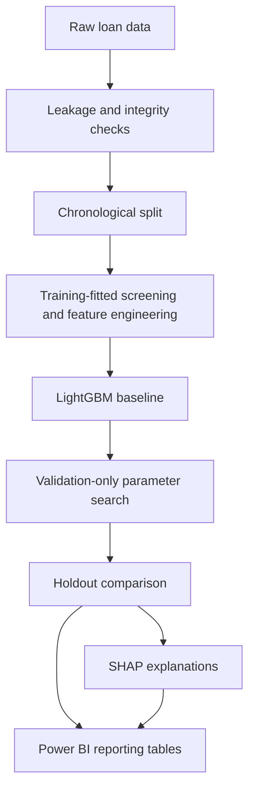
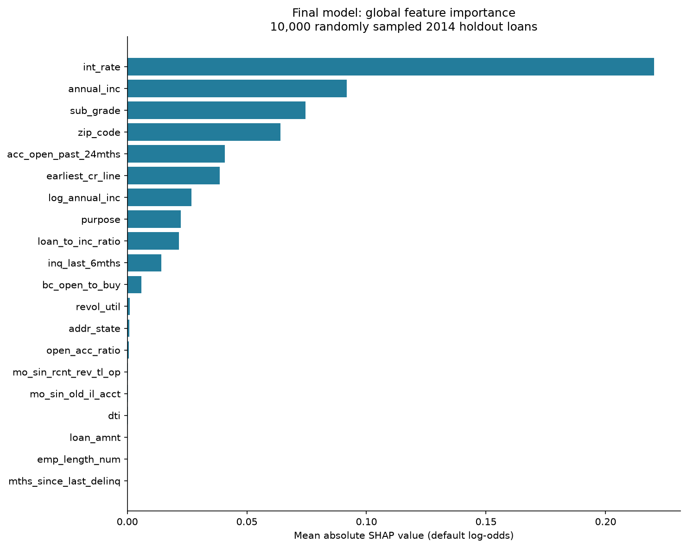

# Loan Default Risk Engine

Loan-default modeling with **LightGBM, chronological evaluation, SHAP explainability and Power BI reporting**. The tuned model improved holdout ROC-AUC from **0.6428 to 0.6595** on 162,570 loans.

## Key Results

Both models were evaluated on the same 2014 holdout cohort.

| Metric | Baseline | Tuned model | Better direction |
|---|---:|---:|---|
| ROC-AUC | 0.6428 | **0.6595** | Higher |
| Average precision | 0.2059 | **0.2158** | Higher |
| Log loss | 0.3852 | **0.3828** | Lower |
| Brier score | 0.1151 | **0.1145** | Lower |

**ROC-AUC gain: +0.0167.** Exact values, uncertainty estimates and threshold results are in the [evaluation report](docs/final_evaluation.md) and [saved metrics](outputs/final_model/metrics.json).

## Project Overview

This project estimates default risk from loan terms, application details and credit-history variables, then examines the model's predictions across loan segments. The target distinguishes **Charged Off** loans from **Fully Paid** loans.

It is a historical modeling study with reproducible experiments and reporting artifacts, not a production lending system.

## ML Pipeline



Known target, repayment, recovery, settlement, hardship and servicing fields are excluded. Missingness filtering and categorical vocabularies are fitted on training rows, then reused for validation and holdout. Data is read in chunks; the integrity checks found no repeated full-row fingerprints or cross-split application-feature fingerprints.

See [data validation and leakage controls](docs/data_validation.md) for the feature-availability decisions and preprocessing rules.

## Dataset and Evaluation Strategy

The local loan dataset contains **2,260,668 rows and 145 columns**. Modeling uses resolved **36-month loans**, with Fully Paid = 0 and Charged Off = 1. Other statuses are excluded, and class prevalence is preserved without balancing or downsampling.

| Split | Issue period | Row count | Purpose |
|---|---|---:|---|
| Train | 2007–2012 | 72,566 | Fit preprocessing and models |
| Validation | 2013 | 100,422 | Early stopping and parameter selection |
| Holdout | 2014 | 162,570 | Compare baseline and tuned model |

The holdout contains **22,315 defaults (13.72639%)**. It has already been used for evaluation and must not be reused for future tuning.

## Feature Engineering

The model uses **72 inputs**, including six engineered features:

- Log transformations of annual income and loan amount.
- Loan-to-income and balance-to-income ratios.
- Open-account ratio.
- Numeric employment length.

Numeric missing values are handled by LightGBM; unseen categories map to missing. Feature definitions and edge-case handling are covered in the [preprocessing documentation](docs/data_validation.md).

## Modeling and Tuning

The baseline used LightGBM with learning rate 0.05, maximum depth 7 and a 500-tree cap. Validation AUC drove early stopping with 50-round patience, leaving **31 trees**.

A **24-trial seeded random search** explored learning rate, tree depth/leaves, minimum child samples, feature/row sampling and regularization. Trials used the same validation cohort, 50-round early stopping and a 1,500-tree cap. Trial 12 improved validation AUC from **0.6426 to 0.6596**.

The tuned model has **57 trees, depth 3 and 8 leaves**, with learning rate approximately 0.0372. It was refitted on the original training cohort with the tree count fixed before holdout scoring. Class weighting remained disabled; model and search seeds were 42.

[Search method and results](docs/tuning_results.md) · [Exact parameters](outputs/tuning/best_params.json)

## Model Results

All four holdout metrics improved, as shown above. The paired, class-stratified bootstrap used 500 resamples and gave a **95% interval of [0.0152, 0.0181]** for the AUC gain, assuming independent loan rows. This met the recorded rule for choosing the tuned model.

ROC-AUC measures ranking. At the unchanged **0.5 classification threshold**, both models predict no positives: **recall is 0% and precision is undefined**. The tuned model's mean score is **13.13030%**, compared with **13.72639%** observed defaults. Calibration and a useful decision threshold remain separate problems. Average precision here is not trapezoidal PR-AUC.

The [holdout evaluation](docs/final_evaluation.md) includes confusion matrices, calibration bins and the model-selection rule.

## Explainability

TreeSHAP explains the saved model on **10,000 randomly sampled holdout loans**, using seed 42, plus four local examples. The leading drivers are interest rate, annual income, sub-grade, ZIP code and accounts opened in the past 24 months.



Higher interest rates, recent account openings and loan-to-income ratios generally raise modeled risk; higher income generally lowers it. Contributions are in default log-odds and describe model behavior, not causality.

The [SHAP analysis](docs/explainability.md) covers effect directions, dependence plots and local explanations.

## Power BI Dashboard

**Power BI dashboard design and reporting layer are complete, but the actual PBIX/PBIP dashboard has not yet been built or validated.**

The design defines a data model, **28 DAX measures** and four pages:

1. **Executive Risk Overview** — portfolio totals, probability bands and observed versus predicted risk.
2. **Portfolio Risk Analysis** — comparisons by purpose, grade, state and issue month.
3. **Model Performance** — baseline/tuned metrics, threshold results and calibration.
4. **Explainability** — SHAP drivers, training gain and direction of model associations.

The local reporting export contains **seven CSVs (19.26 MB)** covering scored loans, risk-band summaries, model metrics, calibration and feature importance. Six aggregate/reference tables are included in Git; `outputs/powerbi/scored_loans.csv` stays local and must be generated for the full report. Probability bands are **[0,10%), [10%,15%), [15%,20%) and [20%,100%]**; they are reporting categories, not approval rules.

[Dashboard specification and DAX](docs/powerbi_dashboard_design.md) · [Reporting tables and data model](docs/powerbi_data.md)

## Project Structure

```text
loan-default-risk-engine/
├── src/              # validation, features, training and evaluation
├── tests/            # split, modeling and reporting checks
├── docs/             # methodology and experiment reports
├── outputs/          # models, metrics, explanations and reporting tables
├── data/             # local dataset and data dictionary
├── .gitignore
├── README.md
└── requirements.txt
```

## Run Locally

Use Python 3.12 and the pinned dependencies:

```powershell
git clone https://github.com/chiragsharma0794/loan-default-risk-engine.git
cd loan-default-risk-engine

py -3.12 -m venv venv
.\venv\Scripts\python.exe -m pip install -r requirements.txt
.\venv\Scripts\python.exe -B -m unittest discover -s tests
```

The tests use small synthetic examples; the last recorded run passed all **13 tests**. Full reproduction requires the original dataset at `data/loan.csv`; it is not included in the repository.

**Run the sequence below in a separate reproduction copy.** The clone includes saved results, and training/export scripts refuse to overwrite them. Preserve those results separately and start the reproduction copy without `outputs/validation/`, `outputs/baseline/`, `outputs/tuning/`, `outputs/final_model/`, `outputs/explainability/`, `outputs/powerbi/` or `outputs/model_comparison.csv`.

```powershell
.\venv\Scripts\python.exe -B src/check_leakage.py
.\venv\Scripts\python.exe -B src/lgbm_model.py
.\venv\Scripts\python.exe -B src/tune_lgbm.py
.\venv\Scripts\python.exe -B src/final_evaluation.py
.\venv\Scripts\python.exe -B src/shap_explainability.py
.\venv\Scripts\python.exe -B src/prepare_powerbi_data.py
```

The [baseline report](docs/baseline_results.md) records the modeling environment; the [data validation report](docs/data_validation.md) records the source fingerprint and split policy. Reproduction repeats the historical experiment; it does not create a new untouched holdout.

## Limitations

- Results cover a selected historical population of resolved 36-month loans, not active loans, all applications or today's portfolio. Outcome timing does not support a true point-in-time deployment backtest.
- Missing borrower identifiers prevent borrower-disjoint checks and clustered uncertainty estimates. Prediction-time availability of some bureau fields remains unconfirmed.
- Discrimination is modest. Calibration and cost-based threshold selection need development data and a new independent evaluation cohort.
- ZIP/date proxies and correlated features warrant subgroup, stability and fairness checks. SHAP does not establish compliance or causality.
- Dataset acquisition, provenance and redistribution rights remain unresolved. A clean-environment rebuild has not been tested.
- Power BI DAX execution, rendering and interaction checks remain pending; production deployment has not been verified.

## Next Steps

A planned second modeling iteration would explore additional feature engineering, temporal cross-validation, CatBoost/XGBoost comparisons, a second tuning round using Optuna, and ensembles. Calibration and threshold optimization would use development data, followed by evaluation on a new held-out cohort.

These experiments have not been run. Data provenance and timing need to be established first; the Power BI report also remains to be implemented from its specification.
